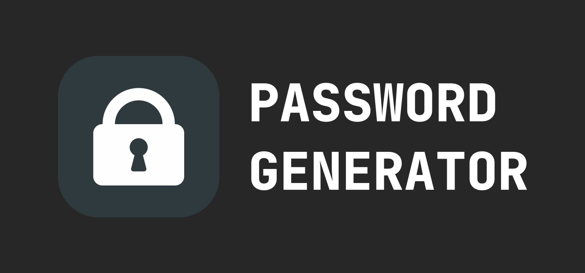

# 🔐 Password Generator Pro

**[Website](https://password-generator.pro) • [Documentation](https://password-generator.pro/docs/)
• [Report Bug](https://github.com/sebastienrousseau/password-generator-pro/issues)
• [Request Feature](https://github.com/sebastienrousseau/password-generator-pro/issues)
• [Contributing Guidelines](https://github.com/sebastienrousseau/password-generator-pro/blob/master/.github/CONTRIBUTING.md)**

***

## 👋 Welcome to Password Generator Pro

A fast, simple and powerful open-source cross platform utility tool for generating strong, unique and random passwords.

## Features

- Generate passwords with a single click
- Generate Bcrypt hashes for passwords

## License

Password Generator Pro is distributed under the terms of both the MIT license
and the Apache License (Version 2.0).

It was originally a fork of [Password Generator](https://github.com/a-poor/password-generator) by [Austin Poor](https://github.com/a-poor).

This new project is a rewrite of the original project and maintained by
[Sebastien Rousseau](https://github.com/sebastienrousseau).

The project is licensed under the terms of both the MIT license and the Apache
License (Version 2.0).

- [Apache License, Version 2.0][1]
- [MIT license][2]

## Contribution

Unless you explicitly state otherwise, any contribution intentionally submitted
for inclusion in the work by you, as defined in the Apache-2.0 license, shall be
dual licensed as above, without any additional terms or conditions.

[1]: http://www.apache.org/licenses/LICENSE-2.0
[2]: http://opensource.org/licenses/MIT
